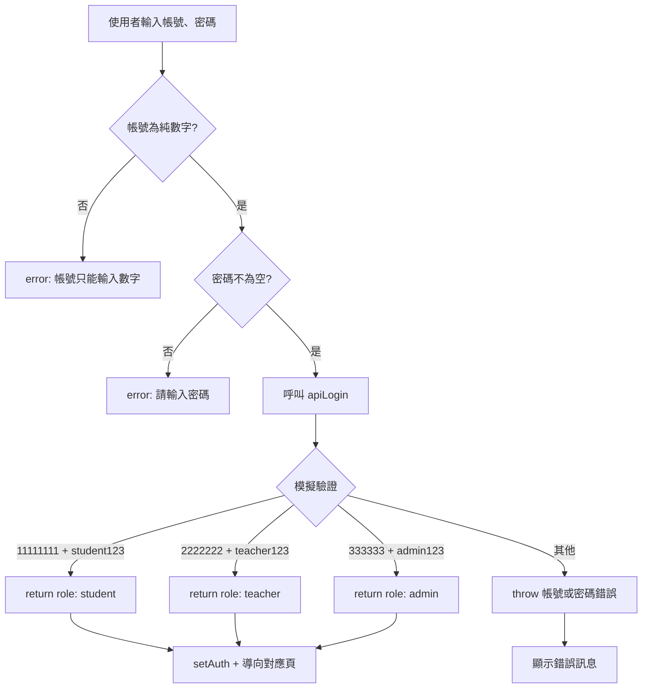
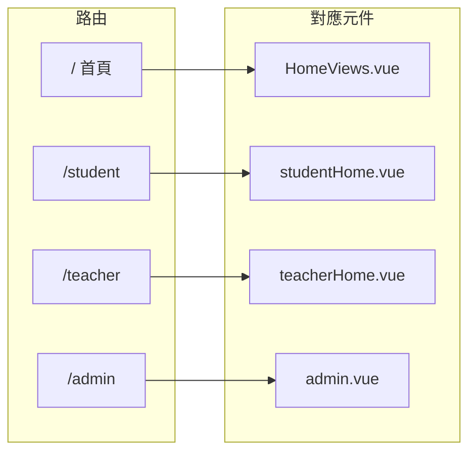
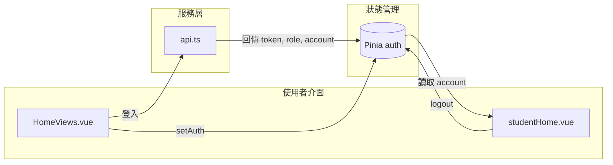

# NFU 資工專題管理系統 - 系統流程圖

## 一、整體系統流程

```mermaid
flowchart TD
    Start([使用者進入系統]) --> Home["首頁 /"]
    Home --> Login{登入}
    
    Login --> |輸入帳號密碼| Validate{驗證}
    Validate --> |帳號非數字| Error1[顯示：帳號只能輸入數字]
    Error1 --> Login
    
    Validate --> |密碼空白| Error2[顯示：請輸入密碼]
    Error2 --> Login
    
    Validate --> |格式正確| API[apiLogin API]
    API --> |失敗| Error3[顯示：帳號或密碼錯誤]
    Error3 --> Login
    
    API --> |成功| Auth[Pinia 儲存登入狀態<br/>token, role, account]
    Auth --> Role{依 role 導向}
    
    Role --> |student| Student[/student 學生頁]
    Role --> |teacher| Teacher[/teacher 教師頁]
    Role --> |admin| Admin[/admin 管理員頁]
    
    Student --> StudentFunc[搜尋 / 登記]
    Teacher --> TeacherFunc[教師功能]
    Admin --> AdminFunc[管理員功能]
    
    StudentFunc --> Logout[點擊登出]
    TeacherFunc --> Logout
    AdminFunc --> Logout
    Logout --> ClearAuth[清除 auth 狀態]
    ClearAuth --> Home
```

---

## 二、登入驗證流程



---

## 三、學生頁面流程

```mermaid
flowchart TD
    StudentPage[/student 學生專題管理] --> Choice{選擇功能}
    
    Choice --> |搜尋| Search[搜尋區塊]
    Choice --> |登記| Register[登記區塊]
    
    Search --> Input[輸入關鍵字]
    Input --> Submit{點擊搜尋 / Enter}
    Submit --> |關鍵字空白| NoOp[不執行]
    Submit --> |有關鍵字| SearchAPI[TODO: 呼叫搜尋 API<br/>目前：模擬資料]
    SearchAPI --> Results[顯示搜尋結果<br/>專題名稱 + 學年度]
    
    Register --> Click[點擊「登記專題」]
    Click --> Alert[目前：alert 提示<br/>TODO: 導向登記表單]
    
    StudentPage --> Logo[點擊 Logo]
    Logo --> Home[回到首頁 /]
    
    StudentPage --> Logout[點擊登出]
    Logout --> Clear[logout + push /]
```

---

## 四、路由架構



---

## 五、資料流向



---

## 六、角色與權限（目前狀態）

| 角色 | 帳號格式 | 測試帳號 | 密碼 | 導向頁面 |
|------|----------|----------|------|----------|
| 學生 | 8 碼數字 | 11111111 | student123 | /student |
| 教師 | 7 碼數字 | 2222222 | teacher123 | /teacher |
| 管理員 | 6 碼數字 | 333333 | admin123 | /admin |

---

> **說明**：此流程圖以 Mermaid 語法撰寫，可在 VS Code（安裝 Mermaid 擴充）、GitHub、或 [mermaid.live](https://mermaid.live) 中預覽。
